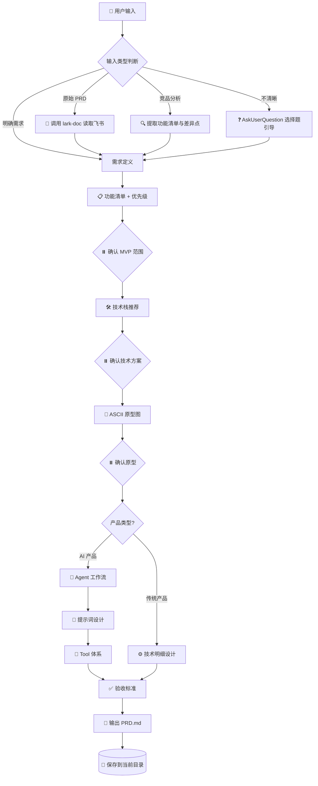
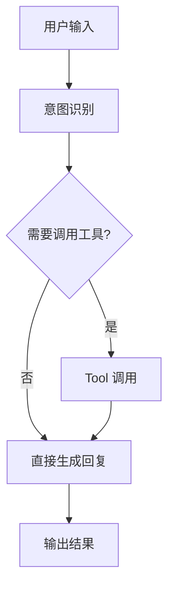

<div align="center">

# 🚀 Vibe Coding PRD Generator

### 把模糊需求 → 编码 Agent 可直接执行的 PRD

[]()
[]()
[]()
[]()

<p>
  <strong>🇨🇳 中文</strong> ｜ 一个把需求/原始PRD/竞品分析提炼成 Vibe Coding PRD 的 TRAE Skill
</p>

---

</div>

## 📖 这是什么

`vibe-coding-prd` 是一个 [TRAE IDE](https://trae.io) 自定义 Skill，用于将**模糊需求、原始工程师 PRD、竞品分析**等输入，提炼成结构精简、可直接喂给 **Claude Code / Codex** 等编码 Agent 执行的 Vibe Coding PRD（Markdown 文档）。

> 💡 **核心理念**：编码 Agent 不需要看商业价值、ROI、排期甘特图，它只需要知道——**做什么、怎么做、做到什么程度算完成**。

---

## ✨ 核心特性

| 特性 | 说明 |
|------|------|
| 🧠 **智能输入识别** | 自动判断输入类型（明确需求 / 原始PRD / 竞品分析 / 不清晰），不清晰时用选择题引导 |
| 🎯 **三关键节点确认** | 仅在功能优先级、技术栈、原型图三处停下确认，其余连续生成，不打断节奏 |
| 🤖 **AI 产品专项支持** | 自动输出 Agent 工作流（mermaid）、提示词模板、Tool 体系清单 |
| 📐 **ASCII 线框原型** | 为核心页面生成框架级原型，技术小白也能看懂 |
| ✅ **可验证验收标准** | 禁止"体验良好"这类模糊描述，每条标准必须可客观验证 |
| 🔗 **飞书文档集成** | 支持直接读取飞书 PRD 链接，自动剥离非编码信息 |
| 🛡️ **不替用户做决定** | 任何模糊处都弹框确认，绝不推断用户意图 |

---

## 🎬 触发方式

在 TRAE IDE 中说以下任一语句即可触发：

```
帮我写一个用来 vibe coding 的 PRD
把这份需求/PRD 转成给编码 Agent 用的
生成 vibe coding 文档
```

---

## 🔄 工作流程



---

## 📦 安装方式

### 方式一：放入 TRAE Skills 目录

```bash
# 克隆仓库
git clone https://github.com/konglp1997/vibe-coding-prd-skill.git

# 复制到 TRAE 项目的 skills 目录
cp -r vibe-coding-prd-skill/.trae/skills/vibe-coding-prd \
      your-project/.trae/skills/
```

### 方式二：手动创建

在你的 TRAE 项目下创建 `.trae/skills/vibe-coding-prd/SKILL.md`，内容见 [`SKILL.md`](./.trae/skills/vibe-coding-prd/SKILL.md)。

---

## 📂 仓库结构

```
vibe-coding-prd-skill/
├── .trae/
│   └── skills/
│       └── vibe-coding-prd/
│           ├── SKILL.md          # Skill 核心定义文件
│           └── README.md         # 本说明文档
└── README.md                     # 仓库根目录说明
```

---

## 📝 PRD 输出结构

生成的 PRD 文档包含以下 6 个部分：

```
# {{产品名}} Vibe Coding PRD

## 1. 需求定义          → 给谁、什么场景、解决什么问题、什么形态
## 2. 功能清单与优先级   → MVP / P1 / P2 / 不做
## 3. 技术栈            → 单一推荐方案 + 一句话理由
## 4. 原型图            → ASCII 线框图（2-4 个核心页面）
## 5. 明细功能设计       → AI 产品: Agent工作流+提示词+Tool
│                        → 传统产品: 数据模型+接口+逻辑
## 6. 验收标准          → 每个功能可客观验证的标准
```

文件命名：`PRD_{{产品名}}_{{YYYYMMDD}}.md`，保存在当前工作目录。

---

## 🎯 适用场景

| 场景 | 输入示例 | Skill 行为 |
|------|---------|-----------|
| 💡 有个点子 | "我想做个个人记账 App" | 选择题引导补全场景与痛点 |
| 📄 飞书 PRD | 贴一个 doubao.com/docx/ 链接 | 读取 → 剥离商业信息 → 提炼 |
| 🏷️ 竞品分析 | "帮我分析 Notion 和飞书的差异，做个更好的" | 提取差异点 → 转为功能清单 |
| ✅ 明确需求 | "给运营团队做个排班工具，Web 端" | 直接进入功能设计 |

---

## 🤖 AI 产品专项输出

当识别为 AI 产品时，Skill 会额外输出三部分：

### 1. Agent 工作流（Mermaid）


### 2. 提示词模板
```text
角色：你是一个 {{角色}}
任务：{{任务描述}}
约束：{{约束条件}}
输出格式：{{格式要求}}
```

### 3. Tool 体系清单

| Tool 名称 | 功能 | 入参 | 出参 | 何时调用 |
|----------|------|------|------|---------|
| search | 搜索信息 | query | results | 用户提问需要外部数据时 |
| ... | ... | ... | ... | ... |

---

## ⚙️ 技术栈推荐范围

| 产品形态 | 推荐方向 |
|---------|---------|
| 🌐 Web 应用 | React / Next.js + Node / Python |
| 📱 移动端 App | React Native / Flutter |
| 🖥️ 桌面应用 | Electron / Tauri |
| 🤖 AI Agent / 脚本 | Python / CLI 工具 |

---

## 🔗 与其他 Skill 协作

- **lark-doc**：读取飞书文档 PRD
- **lark-wiki**：读取知识库节点

---

## 📜 License

MIT License - 自由使用与修改。

---

<div align="center">

**Made with ❤️ for TRAE IDE**

[报告问题](https://github.com/konglp1997/vibe-coding-prd-skill/issues) ｜ [查看 Skill 源码](./.trae/skills/vibe-coding-prd/SKILL.md)

</div>
