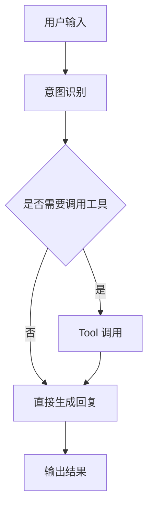

# Vibe Coding PRD 生成器

将模糊需求、原始工程师 PRD、竞品分析等输入，提炼成结构精简、编码 Agent 可直接执行的 Vibe Coding PRD（Markdown 文档）。

## 触发条件

当用户表达以下意图时触发本 Skill：
- "帮我写一个用来 vibe coding 的 PRD"
- "把这份需求/PRD 转成给编码 Agent 用的"
- "生成 vibe coding 文档"
- 任何明确要把需求转化为可直接喂给 Claude Code / Codex 的 PRD 的请求

## 工作流程

### 第 1 步：判断输入类型

读取用户输入，判断属于以下哪一类：

| 类型 | 判断特征 | 处理方式 |
|------|---------|---------|
| **明确需求** | 同时包含：清晰用户群体 + 使用场景 + 痛点描述 | 直接进入第 2 步功能设计 |
| **原始 PRD** | 给工程师看的 PRD，可能含飞书文档链接（doubao.com/docx/ 或 /wiki/）、含商业价值/ROI/排期等非编码信息 | 调用 lark-doc skill 读取飞书内容 → 提炼编码 Agent 需知信息 → 去除商业价值、ROI、排期甘特图等描述 → 进入第 2 步 |
| **竞品分析** | 含多个产品对比、功能矩阵、优劣势分析 | 提取可参考的功能清单与差异点 → 进入第 2 步 |
| **不清晰** | 缺少用户/场景/痛点中的任一项 | **必须用 AskUserQuestion 工具以选择题方式引导用户说出真实需求**，不得自行推断 |

**关键约束：禁止推断用户意图。** 任何模糊处都必须停下来用 AskUserQuestion 弹框让用户确认，不要替用户做决定。

### 第 2 步：功能设计（核心环节）

按以下顺序生成，**仅在三个关键节点停下让用户确认**：功能清单优先级、技术栈选择、原型图设计。其余环节连续生成。

#### 2.1 需求定义

输出一段精简的需求定义，包含四要素：
- **给谁用**：目标用户角色
- **什么场景**：使用场景与触发时机
- **解决什么问题**：核心痛点
- **什么形态的产品**：Web/App/桌面应用/AI Agent/CLI 工具

#### 2.2 功能清单 + 优先级确认【关键节点1】

输出功能清单表格：

| 一级模块 | 二级功能 | 功能描述 | 优先级 |
|---------|---------|---------|--------|
| 模块A | 功能A1 | 一句话说明做什么 | MVP / P1 / P2 / 不做 |

优先级排序原则：
- **MVP**：核心闭环必需、去掉就无法验证产品价值的功能，优先开发
- **P1**：重要增强，MVP 之后第一批做
- **P2**：可有可无的锦上添花
- **不做**：本期明确排除

**生成清单后，必须用 AskUserQuestion 工具询问用户**：
- 哪些做 / 哪些不做
- MVP 范围是否正确
- 优先级排序是否需要调整

用 multiSelect 让用户勾选要纳入 MVP 的功能。

#### 2.3 技术栈推荐【关键节点2】

基于产品大小、复杂程度、实现时限，给出**单一推荐方案**（不给多方案对比让用户纠结），但说明理由。

推荐需覆盖：
- **前端**：框架 + UI 库 + 状态管理
- **后端**：语言 + 框架 + 数据库
- **部署**：托管方案
- **AI 能力**（如涉及）：模型 + Agent 框架

用户是技术小白，**必须对每个技术选择用一句话解释为什么选它**，避免堆砌术语。

技术栈范围覆盖：Web 应用、移动端 App（React Native / Flutter）、桌面应用（Electron / Tauri）、AI Agent / 脚本工具（Python / CLI）。

**生成后用 AskUserQuestion 让用户确认是否接受推荐，或提出调整方向。**

#### 2.4 原型图设计（框架版）【关键节点3】

为**核心主功能界面**设计 ASCII 线框图，不是所有页面，只画 2-4 个关键页面。

格式示例：
```
┌─────────────────────────────────────┐
│  [Logo]        搜索框      [头像]    │
├─────────────────────────────────────┤
│  侧边栏                             │
│  · 首页      ┌──────────────────┐   │
│  · 项目      │   主内容区        │   │
│  · 设置      │   卡片列表        │   │
│              │                  │   │
│              └──────────────────┘   │
└─────────────────────────────────────┘
```

**生成后用 AskUserQuestion 让用户二次确认原型是否符合预期。**

#### 2.5 明细功能模块

根据产品类型分流：

**A. AI 产品**（含 Agent / LLM 调用），输出三部分：

1. **Agent 工作流**：用 mermaid 流程图描述


2. **提示词设计**：给出完整提示词模板，包含角色、任务、约束、输出格式。用代码块包裹，标注变量占位符 `{{变量名}}`。

3. **Tool 体系**：列出 Agent 可调用的工具清单
| Tool 名称 | 功能 | 入参 | 出参 | 何时调用 |
|----------|------|------|------|---------|

**B. 传统产品**：按模块输出技术设计明细，包含数据模型、接口定义、核心逻辑。

#### 2.6 验收标准

为**每一个功能**写出明确的验收标准，格式：

```
【功能名】
验收标准：
1. 用户点击 X 按钮 → 页面跳转到 Y
2. 输入框为空时点击提交 → 显示错误提示「XXX不能为空」
3. 列表加载完成 → 默认按时间倒序展示，每页 20 条
```

**禁止模糊验收标准**，如"体验良好""响应快速""界面美观"——必须可被客观验证。

## 执行限制（全局约束）

1. **禁止推断用户意图**：任何不确定的地方，用 AskUserQuestion 弹框让用户确认，不要替用户做决定。
2. **PRD 内容精简**：少用黑话和商业术语，编码 Agent 能看懂即可。避免"赋能""闭环""抓手"这类词。
3. **关键节点确认**：只在功能清单优先级、技术栈选择、原型图设计三个点停下确认，其余连续生成。
4. **语言**：PRD 全程使用中文。
5. **不创建多余文件**：只生成一个 PRD markdown 文件，不额外创建 README、说明文档等。

## 输出规范

最终输出一份完整的 Markdown PRD 文档，结构如下：

```markdown
# {{产品名}} Vibe Coding PRD

> 生成日期：YYYY-MM-DD
> 目标 Agent：Claude Code / Codex

## 1. 需求定义
## 2. 功能清单与优先级
## 3. 技术栈
## 4. 原型图（ASCII 线框）
## 5. 明细功能设计
  ### 5.1 Agent 工作流（AI 产品）
  ### 5.2 提示词设计（AI 产品）
  ### 5.3 Tool 体系（AI 产品）
  ## 或 5. 技术明细设计（传统产品）
## 6. 验收标准
```

**文件保存位置**：当前工作目录
**文件命名规则**：`PRD_{{产品名}}_{{YYYYMMDD}}.md`

生成完成后，用 Write 工具将文件写入当前工作目录，并告知用户文件路径。

## 与其他 Skill 的协作

- **lark-doc**：当用户输入是飞书文档链接（doubao.com/docx/ 或 /wiki/ URL）时，调用 lark-doc skill 读取文档内容。
- **lark-wiki**：当链接是 /wiki/ 路径时，通过 lark-wiki 获取节点内容。
- 其他 skill 按需调用，但仅限于读取输入所需，不主动扩展。

## 示例对话

**用户**：帮我写一个用来 vibe coding 的 PRD，我想做一个个人记账 App

**Skill 行为**：
1. 判断输入 → 不清晰（缺少场景、痛点细节）→ 用 AskUserQuestion 引导
2. 用户补充后 → 生成需求定义 → 功能清单 → 弹框确认优先级 → 技术栈 → 弹框确认 → 原型 → 弹框确认 → 明细 → 验收标准
3. Write 保存为 `PRD_个人记账App_20260702.md`
